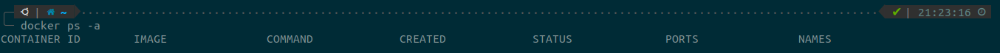
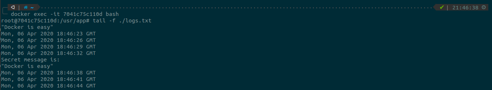
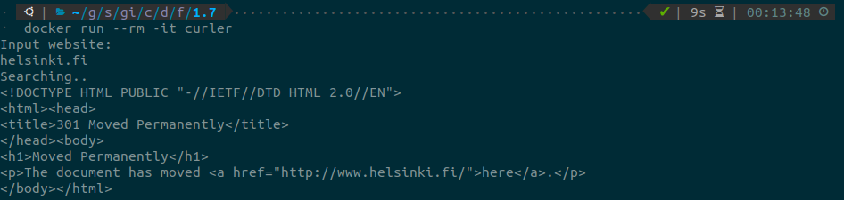
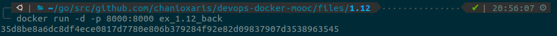

## [Part 1](https://devopswithdocker.com/part1/)

### 1.1

Create 3 new containers from `nginx` image in detached mode.

`$ for _ in {1..3}; do docker run -d nginx; done`

Stop 2 of the containers.

`$ docker stop $(docker ps -q | head -2)`

List all containers.

`$ docker ps -a`

### 1.2

To remove all containers either stop the last running container or use the force flag.

`$ docker stop d58e3c93f5ee`

`$ docker container prune`

OR

`$ docker rm $(docker ps -a -q) --force`

Remove all images.

`$ docker rmi $(docker images -q)`

List all containers.

`$ docker ps -a`

List images.

`$ docker images`

### 1.3

Create a new container from `devopsdockeruh/pull_exercise` image in interactive mode.

`$ docker run -it devopsdockeruh/pull_exercise`

Use `basics` for input as described in the image readme at Docker hub. This result to the secret message `This is the secret message`.

### 1.4

Create a new container from `devopsdockeruh/exec_bash_exercise` image.

Use exec command to start a bash session into the container.

`$ docker exec -it 7041c75c110d bash`

Tail the log file and find the secret message `Docker is easy`.

### 1.5

First of all we need to install the curl command as it's not pre-installed in the ubuntu image.
Then create a new container in interactive mode so that waits for user input.

`$ docker run -it --rm ubuntu sh -c 'apt-get update; apt-get install curl -y; echo "Input website: "; read website; echo "Searching..."; sleep 1; curl http://$website;'`

### 1.6

The Dockerfile is located [here](Part1/1.6/Dockerfile)

The base Dockerfile uses the `./start.sh` script as entry point, so we have to add a `CMD` command on our 
own Dockerfile with the necessary arguments to start a clock.

Build a new image from the Dockerfile and tag it as `docker-clock`.

`$ docker build -t docker-clock .`

Create a new container from our newest build image `docker-clock`.

`$ docker run docker-clock`

### 1.7

The Dockerfile is located [here](Part1/1.7/Dockerfile)

The script is located [here](Part1/1.7/script.sh)

We based our Dockerfile on `ubuntu:18.04` image. Install curl command, and copy the `script.sh` file from the 
host machine into the container. We also need to give execute (+x) permission to the script, and add a `CMD` command to 
start it.

Build a new image from the Dockerfile and tag it as `curler`.

`$ docker build -t curler .`

Create a new container from our newest build image `curler` in interactive mode to input the requested url.

`$ docker run --rm -it docker-clock`

### 1.8

On our host machine create a new `logs.txt` file.

`$ touch logs.txt`

Create a new container from `devopsdockeruh/first_volume_exercise` image and bind as volume the previously 
created `logs.txt` file.

`$ docker run --mount type=bind,source="$(pwd)"/logs.txt,target=/usr/app/logs.txt devopsdockeruh/first_volume_exercise`

Check the content of the local `logs.txt` file.

### 1.9

Create a new container from `devopsdockeruh/ports_exercise` image and publish `8080` port on host machine.

`$ docker run -p 8080:80 devopsdockeruh/ports_exercise`

Check if port mapping worked as expected.

`$ curl http://localhost:8080`

### 1.10

The Dockerfile is located [here](Part1/1.10/Dockerfile)

Build a new image from the Dockerfile.

`$ docker build -t ex_1.10 .`

Create a new container from `ex_1.10` image and publish `8080` port on host machine.

`$ docker run -p 8080:5000 ex_1.10`

Check if everything is working as expected.

`$ curl http://localhost:8080`

### 1.11

The Dockerfile is located [here](Part1/1.11/Dockerfile)

On our host machine create a new `logs.txt` file.

`$ touch logs.txt`

Build a new image from the Dockerfile.

`$ docker build -t ex_1.11 .`

Create a new container from `ex_1.11` image, publish `8000` port and bind the corresponding volume.

`$ docker run -p 8000:8000 --mount type=bind,source="$(pwd)"/logs.txt,target=/logs.txt ex_1.11`

Check the content of the local `logs.txt` file.

### 1.12

The Dockerfile for frontend project is located [here](Part1/1.12/Dockerfile.frontend)

The Dockerfile for backend project is located [here](Part1/1.12/Dockerfile.backend)

We have to set the requested environment variables `API_URL` and `FRONT_URL` to match the running url.

Build a new image from our frontend Dockerfile.

`$ docker build -t ex_1.12_front -f Dockerfile.frontend .`

Build a new image from our backend Dockerfile.

`$ docker build -t ex_1.12_back -f Dockerfile.backend .`

Create a new container from `ex_1.12_front` image in detached mode and publish `5000` port.

`$ docker run -d -p 5000:5000 ex_1.12_front`

Create a new container from `ex_1.12_back` image in detached mode and publish `8000` port.

`$ docker run -d -p 8000:8000 ex_1.12_back`

Check if everything is working as expected.

### 1.13

The Dockerfile is located [here](Part1/1.13/Dockerfile)

Our Dockerfile is based on `openjdk:8` image as the project requires.

Build a new image from the Dockerfile.

`$ docker build -t ex_1.13 .`

Create a new container from `ex_1.13` image in detached mode and publish `8080` port.

`$ docker run -d -p 8080:8080 ex_1.13`

Check if everything is working as expected.

### 1.14

The Dockerfile is located [here](Part1/1.13/Dockerfile)

Our Dockerfile is based on `ruby:2.6.0` as the project requires. We also need to change the permissions 
of the `tmp` directory for the `apt-get`, to be able to update and then install `node.js`.

Build a new image from the Dockerfile.

`$ docker build -t ex_1.14 .`

Create a new container from `ex_1.14` image in detached mode and publish `3000` port.

`$ docker run -d -p 3000:3000 ex_1.14`

Check if everything is working as expected.

### 1.15

The Dockerfile is located [here](Part1/1.15/Dockerfile)

We will use an example application build with `Golang` which is located [here](Part1/1.15/golang-example-project)

Build a new image from the Dockerfile.

`$ docker build -t ex_1.15 .`

Tag our newly created image.

`$ docker tag ex_1.15 chanioxaris/mooc-devops-golang`

Push our image to Docker Hub, which can be found [here](https://hub.docker.com/repository/docker/chanioxaris/mooc-devops-golang)

`$ docker push chanioxaris/mooc-devops-golang`

Create a new container from `chanioxaris/mooc-devops-golang` image and publish `8080` port.

`$ docker run -p 8080:8080 chanioxaris/mooc-devops-golang`

Check if everything is working as expected.

`$ curl http://localhost:8080/ping`

### 1.16

Pull the requested `devopsdockeruh/heroku-example` image.

`$ docker push devopsdockeruh/heroku-example`

Tag it to match our heroku app name (`chanioxaris-mooc-devops`).

`$ docker tag devopsdockeruh/heroku-example registry.heroku.com/chanioxaris-mooc-devops/web`

Push it to heroku registry.

`$ docker push registry.heroku.com/chanioxaris-mooc-devops/web`

Release the application using heroku cli.

`$ heroku container:release web`

The released application can be found [here](https://chanioxaris-mooc-devops.herokuapp.com/)