## [Part 2](https://devopswithdocker.com/part2/)

### 2.1

The Docker Compose is located [here](Part2/2.1/docker-compose.yaml)

On our host machine create a new file `logs.txt` to mount into the container.

`$ touch logs.txt`

Create a new container.

`$ docker-compose up`

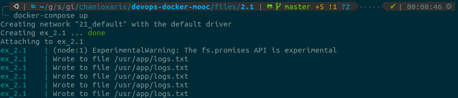

Check the content of our local `logs.txt` file.

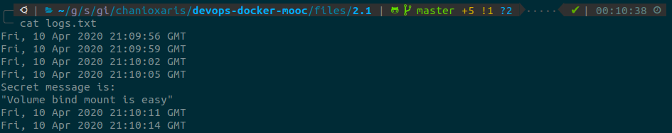

### 2.2

The Docker Compose is located [here](Part2/2.2/docker-compose.yaml)

Create a new container.

`$ docker-compose up -d`

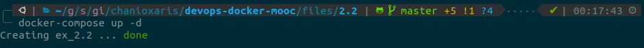

Check if everything is working as expected.

`$ curl http://localhost:8080`

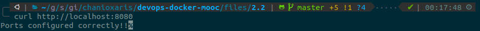

### 2.3

The Docker Compose is located [here](Part2/2.3/docker-compose.yaml)

Create both frontend and backend containers.

`$ docker-compose up -d`

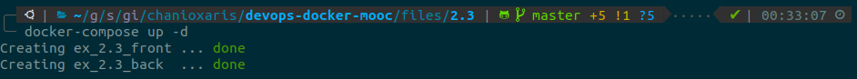

Check if everything is working as expected.

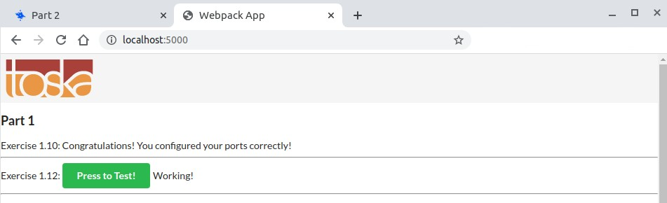

### 2.4

Scale the compute service to run 2 containers.

`$ docker-compose up -d --scale compute=2`

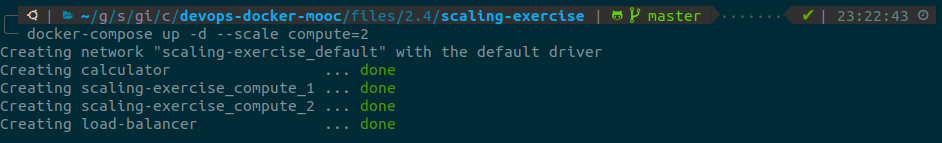

Check if everything is working as expected.

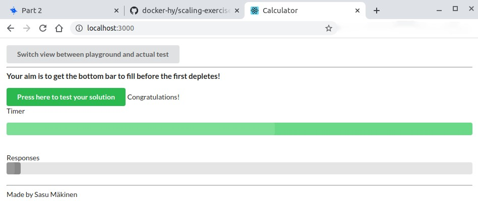

### 2.5

The Docker Compose is located [here](Part2/2.5/docker-compose.yaml)

Create frontend, backend and redis containers.

`$ docker-compose up -d`

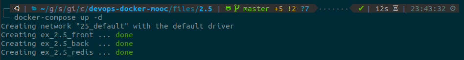

Check if everything is working as expected.

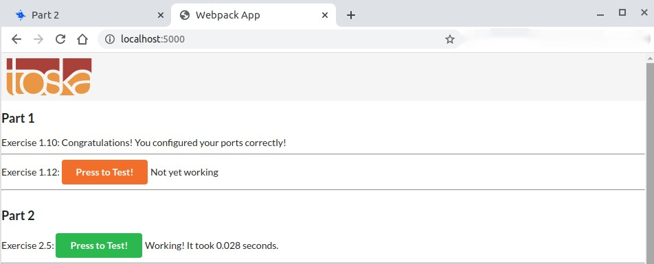

### 2.6

The Docker Compose is located [here](Part2/2.6/docker-compose.yaml)

Create frontend, backend, redis and postgres containers.

`$ docker-compose up -d`

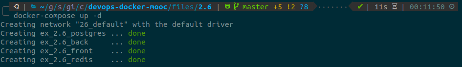

Check if everything is working as expected.

### 2.7

The Docker Compose is located [here](Part2/2.7/docker-compose.yaml)

Create frontend, backend and training containers.

`$ docker-compose up -d`

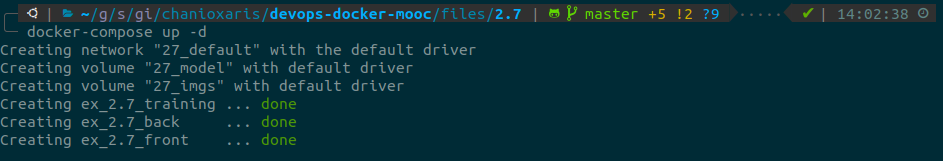

We must wait for the training container to create the model. Tail the logs of the container to be informed when is ready.

`$ docker logs ex_2.7_training -f`

Check if everything is working as expected.

### 2.8

The Docker Compose is located [here](Part2/2.8/docker-compose.yaml)

The needed `nginx.conf` file is located [here](Part2/2.8/nginx.conf)

Create frontend, backend, redis, postgres and nginx containers.

`$ docker-compose up -d`

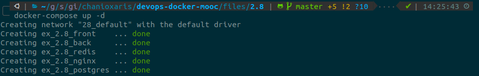

Check if everything is working as expected.

### 2.9

The Docker Compose is located [here](Part2/2.9/docker-compose.yaml)

The needed nginx.conf file is located [here](Part2/2.9/nginx.conf)

On our host machine create a new directory `database` to mount into postgres container.

`$ mkdir database`

Create frontend, backend, redis, postgres and nginx containers.

`$ docker-compose up -d`

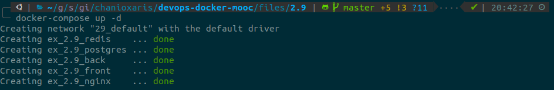

Restart the postgres container.

`$ docker restart ex_2.9_postgres`

Check if everything is working as expected.

### 2.10

The Docker Compose is located [here](Part2/2.10/docker-compose.yaml)

The needed `nginx.conf` file is located [here](Part2/2.10/nginx.conf)

On our host machine create a new directory `database` to mount into postgres container.

`$ mkdir database`

Create frontend, backend, redis, postgres and nginx containers.

`$ docker-compose up -d`

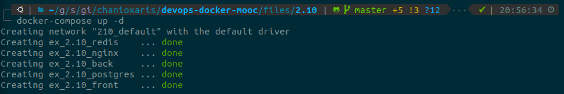

Check if everything is working as expected.

