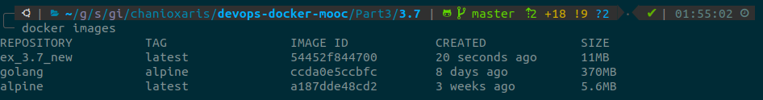

## [Part 3](https://devopswithdocker.com/part3/)

### 3.1

For the frontend project the new Dockerfile is located 
[here](/Part3/3.1/Dockerfile.frontend) and the old one [here](/Part1/1.12/Dockerfile.frontend)

Build and inspect the image size before any improvements, which is `516 MB`.

`$ docker build -t ex_3.1_front_old -f ../../Part1/1.12/Dockerfile.frontend .`

`$ docker image inspect ex_3.1_front_old --format='{{.Size}}'`

Build and inspect the image size after the improvements, which is `487 MB`

`$ docker build -t ex_3.1_front_new -f Dockerfile.frontend .`

`$ docker image inspect ex_3.1_front_new --format='{{.Size}}'`

We managed to reduce the image size by `29 MB` after removing apt-source lists and curl.

For the backend project the new Dockerfile is located 
[here](/Part3/3.1/Dockerfile.backend) and the old one [here](/Part1/1.12/Dockerfile.backend)

Build and inspect the image size before any improvements, which is `336 MB`.

`$ docker build -t ex_3.1_back_old -f ../../Part1/1.12/Dockerfile.backend .`

`$ docker image inspect ex_3.1_back_old --format='{{.Size}}'`

Build and inspect the image size after the improvements, which is `307 MB`.

`$ docker build -t ex_3.1_back_new -f Dockerfile.backend .`

`$ docker image inspect ex_3.1_back_new --format='{{.Size}}'`

We managed to reduce the image size by `29 MB` after removing apt-source lists and curl.

### 3.2

We will use Github Actions instead of CircleCI, to create a deployment pipeline from Github to Heroku.

A new `main.yml` file, which it is located [here](.github/workflows/main.yml), has been added that includes the action, 
the jobs and the steps needed for the specific workflow.

The action is being triggered, after a push occurs on master branch and the `Part3/3.2` directory.

You can find the deployed app [here](https://chanioxaris-mooc-workflow.herokuapp.com/)

### 3.3

The Dockerfile is located [here](Part3/3.3/Dockerfile)

The script is located [here](Part3/3.3/buildService.sh)

Build a new image from the Dockerfile. 

`$ docker build -t ex_3.3 .`

Create a new container from `ex_3.3` image in interactive mode with bash session and mount host machine's docker 
socket into the container.

`$ docker run -it -v /var/run/docker.sock:/var/run/docker.sock ex_3.3 bash`

Fill any required information (docker hub username/password, image tag and github repo url) to start the build service.

You can find the new image published in your Docker Hub repository.

### 3.4

The Dockerfile for the frontend project is located [here](Part3/3.4/Dockerfile.frontend)

The Dockerfile for the backend project is located [here](Part3/3.4/Dockerfile.backend)

### 3.5 

The Dockerfile for the frontend project is located [here](Part3/3.5/Dockerfile.frontend)

Using the `ubuntu:16:04` as base, the image size would be `487 MB`

After using the `node:alpine` as base, the new image size would be `327 MB`

We managed to reduce the image size by `160 MB` by using a different base image.

The Dockerfile for the backend project is located [here](Part3/3.5/Dockerfile.backend)

Using the `ubuntu:16:04` as base, the image size would be `307 MB`.

After using the `node:alpine` as base, the new image size would be `147 MB`.

We managed to reduce the image size by `160 MB` by using a different base image.

### 3.6

The Dockerfile is located [here](Part3/3.6/Dockerfile)

With the use of a multi-stage build we reduced our image size down to `124 MB` from the original `327 MB`,
gaining a total of `203 MB`.

### 3.7

As a reference we are gonna use the [golang-example-project](/Part1/1.15/golang-example-project)from 1.15 exercise.

The new Dockerfile is located [here](/Part3/3.7/Dockerfile) and the old one [here](/Part1/1.15/Dockerfile)

Before any improvements the image has a size of `817 MB`.

After applying all the improvements (alpine images, multi-stage build, non-root user) the new image is `11 MB`.

We managed to reduce the image size by `806 MB`.
